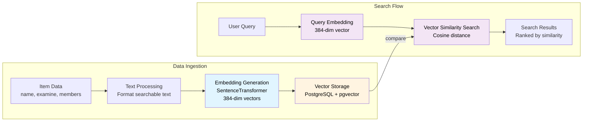
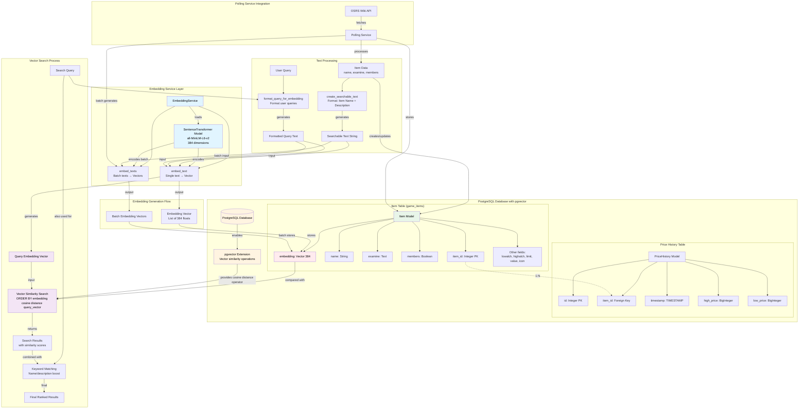

# Embedding and Vector Store Database Architecture

## High-Level Overview

## Detailed Architecture

## Key Components

### 1. Embedding Service
- **EmbeddingService**: Singleton service managing embedding generation
- **SentenceTransformer Model**: Uses `all-MiniLM-L6-v2` (384 dimensions) by default
- **Methods**: 
  - `embed_text()`: Single text → vector
  - `embed_texts()`: Batch processing for efficiency

### 2. Text Processing
- **create_searchable_text()**: Formats item data as "Item Name: X | Description: Y"
- **format_query_for_embedding()**: Formats user queries to match item embedding structure

### 3. Database Schema
- **Item Table**: Stores items with vector embeddings in `embedding` column (Vector(384))
- **pgvector Extension**: Enables vector similarity operations (<=> operator)
- **PriceHistory Table**: Tracks price changes over time (separate from embeddings)

### 4. Vector Search
- Uses PostgreSQL's `<=>` operator for cosine distance
- Hybrid search: Combines vector similarity (70%) with keyword matching (30%)
- Returns results ordered by combined similarity score

### 5. Data Flow
1. Item data → Searchable text → Embedding vector → Stored in database
2. User query → Formatted query → Query embedding → Vector similarity search → Results

