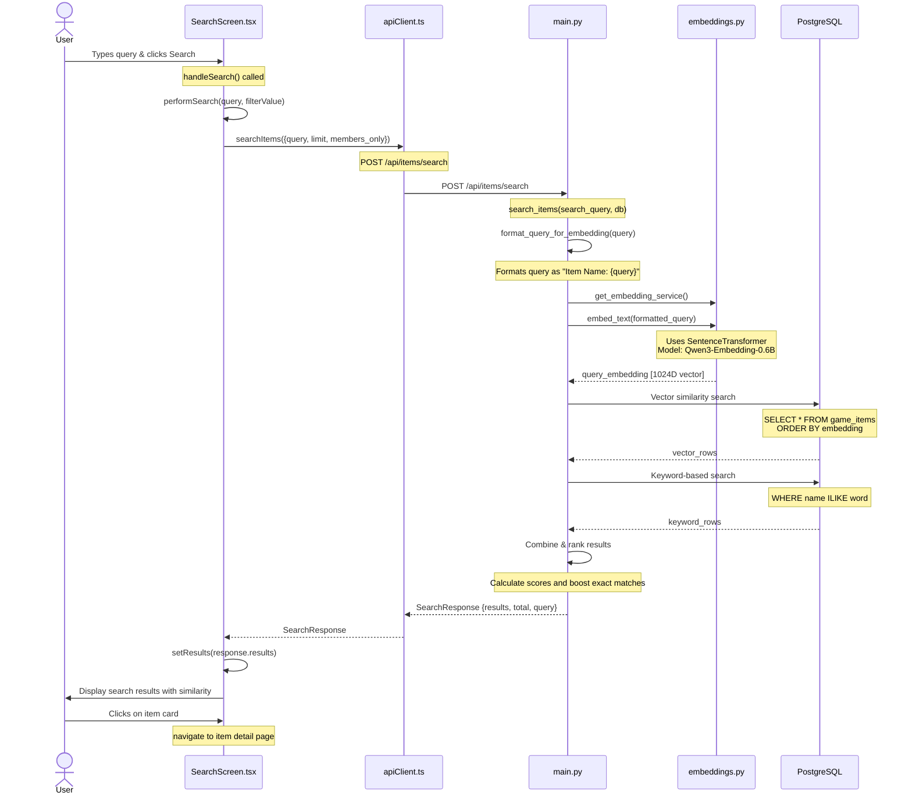
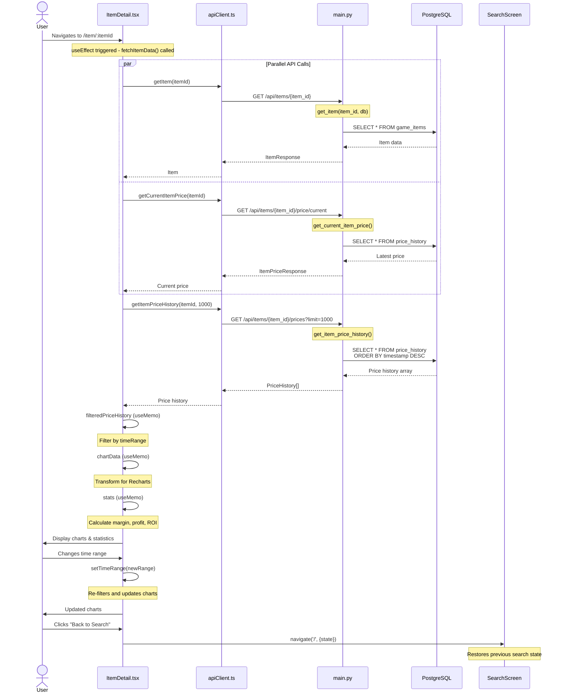
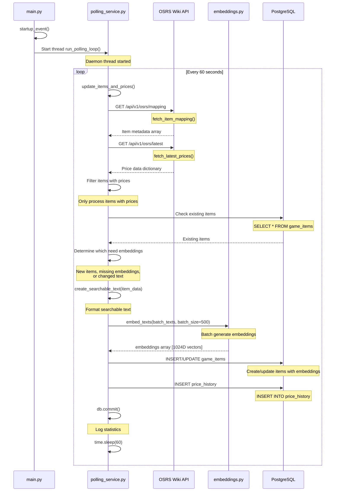
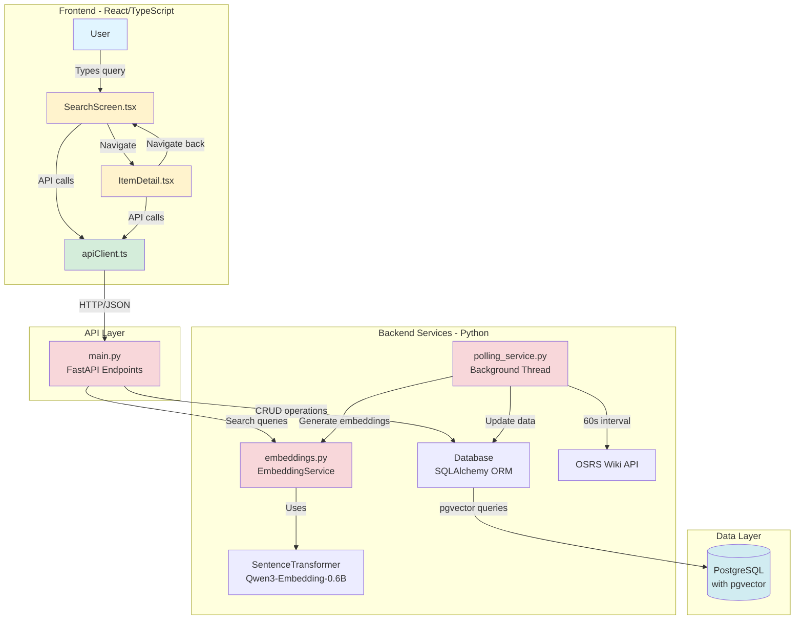

# Method Flow Diagram - User Interactions

This document shows the complete flow of user interactions through the RuneScape Smart Item Search application, including specific methods, files, and data flows.

## 🔍 Flow 1: Search Items (Semantic Search)



### Key Methods - Search Flow

| File | Method/Function | Purpose |
|------|----------------|---------|
| `SearchScreen.tsx` | `handleSearch()` | Triggers search, updates URL with query params |
| `SearchScreen.tsx` | `performSearch(query, filterValue)` | Calls API client with search parameters |
| `SearchScreen.tsx` | `setResults()` | Updates UI with search results |
| `apiClient.ts` | `searchItems(request)` | POST to `/api/items/search` endpoint |
| `main.py` | `search_items(search_query, db)` | Main search endpoint handler |
| `embeddings.py` | `format_query_for_embedding(query)` | Formats query to match item embedding structure |
| `embeddings.py` | `get_embedding_service()` | Returns singleton EmbeddingService instance |
| `embeddings.py` | `embed_text(text)` | Generates 1024D vector for text |
| `main.py` | Ranking algorithm | Combines vector similarity + keyword matching |

---

## 📊 Flow 2: View Item Details



### Key Methods - Item Detail Flow

| File | Method/Function | Purpose |
|------|----------------|---------|
| `ItemDetail.tsx` | `useEffect` hook | Fetches item data on component mount |
| `ItemDetail.tsx` | `fetchItemData()` | Orchestrates parallel API calls |
| `apiClient.ts` | `getItem(itemId)` | GET single item by ID |
| `apiClient.ts` | `getCurrentItemPrice(itemId)` | GET latest price for item |
| `apiClient.ts` | `getItemPriceHistory(itemId, limit)` | GET price history array |
| `main.py` | `get_item(item_id, db)` | Retrieves item from database |
| `main.py` | `get_current_item_price(item_id, db)` | Gets most recent price entry |
| `main.py` | `get_item_price_history(item_id, limit, db)` | Gets historical prices |
| `ItemDetail.tsx` | `filteredPriceHistory` (useMemo) | Filters prices by time range |
| `ItemDetail.tsx` | `chartData` (useMemo) | Transforms data for charts |
| `ItemDetail.tsx` | `stats` (useMemo) | Calculates trading statistics |

---

## 🔄 Flow 3: Background Data Polling



### Key Methods - Polling Flow

| File | Method/Function | Purpose |
|------|----------------|---------|
| `main.py` | `startup_event()` | Initializes app, starts polling thread |
| `polling_service.py` | `run_polling_loop()` | Infinite loop that runs every 60 seconds |
| `polling_service.py` | `update_items_and_prices()` | Main update orchestration function |
| `polling_service.py` | `fetch_item_mapping()` | GET item metadata from Wiki API |
| `polling_service.py` | `fetch_latest_prices()` | GET current prices from Wiki API |
| `embeddings.py` | `create_searchable_text(item_data)` | Formats item data for embedding |
| `embeddings.py` | `embed_texts(texts, batch_size)` | Batch generates embeddings (500 at a time) |
| `database.py` | Database operations | INSERT/UPDATE items and price history |

---

## 🏗️ Architecture Overview



---

## 📦 Component Method Details

### Frontend Components

#### SearchScreen.tsx
```typescript
// State Management
const [query, setQuery] = useState('')
const [results, setResults] = useState<SearchResult[]>([])
const [membersOnly, setMembersOnly] = useState<boolean | null>(null)

// Core Methods
handleSearch()               // Triggers search, updates URL
performSearch(query, filter) // Calls API client
handleKeyPress(e)           // Enter key triggers search

// Navigation
navigate('/item/:id', {state}) // Preserves search state
```

#### ItemDetail.tsx
```typescript
// State Management
const [item, setItem] = useState<Item | null>(null)
const [currentPrice, setCurrentPrice] = useState<ItemPriceResponse | null>(null)
const [priceHistory, setPriceHistory] = useState<PriceHistory[]>([])
const [timeRange, setTimeRange] = useState<TimeRange>('24h')

// Data Fetching
useEffect(() => fetchItemData())
fetchItemData()              // Parallel Promise.all for item + price

// Computed Values (useMemo)
filteredPriceHistory         // Filter by timeRange
chartData                    // Transform for Recharts
stats                        // Calculate margin, profit, ROI

// Utilities
formatTime(timestamp)        // Format for display
formatCurrency(value)        // Format numbers as GP
formatTimeAgo(timestamp)     // Relative time (e.g., "2 hours ago")
```

#### apiClient.ts
```typescript
class ApiClient {
  // Core API Methods
  searchItems(request: SearchRequest): Promise<SearchResponse>
  getItem(itemId: number): Promise<Item>
  getCurrentItemPrice(itemId: number): Promise<ItemPriceResponse>
  getItemPriceHistory(itemId: number, limit: number): Promise<PriceHistory[]>
  listItems(options): Promise<Item[]>
  
  // Private Helper
  private async fetch<T>(endpoint, options): Promise<T>
}

// Singleton export
export const apiClient = new ApiClient()
```

### Backend Endpoints

#### main.py (FastAPI)
```python
# Startup
@app.on_event("startup")
async def startup_event()
    # Starts polling service thread

# API Endpoints
@app.get("/health")
async def health_check(db)
    # Returns DB status, pgvector status, table existence

@app.post("/api/items/search")
async def search_items(search_query, db)
    # 1. format_query_for_embedding(query)
    # 2. embedding_service.embed_text(formatted_query)
    # 3. Vector search: ORDER BY embedding <=> query_vector
    # 4. Keyword search: ILIKE '%word%'
    # 5. Combine, rank, boost exact matches
    # 6. Return top results

@app.get("/api/items/{item_id}")
async def get_item(item_id, db)
    # Query single item by ID

@app.get("/api/items/{item_id}/prices")
async def get_item_price_history(item_id, limit, db)
    # Query price_history ORDER BY timestamp DESC

@app.get("/api/items/{item_id}/price/current")
async def get_current_item_price(item_id, db)
    # Query latest price (LIMIT 1)

@app.post("/api/items")
async def create_item(item, db)
    # Create with embedding generation

@app.post("/api/items/batch")
async def create_items_batch(batch, db)
    # Batch create with bulk embedding generation
```

#### embeddings.py
```python
class EmbeddingService:
    def __init__(model_name: str = "Qwen/Qwen3-Embedding-0.6B")
        # Loads SentenceTransformer model
        # Dimension: 1024
    
    def embed_text(text: str) -> List[float]
        # Single text embedding
    
    def embed_texts(texts: List[str], batch_size: int = 32) -> List[List[float]]
        # Batch embedding generation
    
    def get_dimension() -> int
        # Returns 1024

# Utility Functions
def get_embedding_service() -> EmbeddingService
    # Singleton pattern

def create_searchable_text(item_data: dict) -> str
    # Format: "Item Name: {name} | Description: {examine} | Members only item"

def format_query_for_embedding(query: str) -> str
    # Format query to match item embedding structure
    # Default: "Item Name: {query}"
```

#### polling_service.py
```python
def fetch_item_mapping() -> List[Dict]
    # GET https://prices.runescape.wiki/api/v1/osrs/mapping

def fetch_latest_prices() -> Dict[int, Dict]
    # GET https://prices.runescape.wiki/api/v1/osrs/latest

def update_items_and_prices()
    # 1. Fetch mapping and prices from Wiki API
    # 2. Filter items with prices
    # 3. Check existing items in DB
    # 4. Determine which need embeddings
    # 5. Batch generate embeddings (500 at a time)
    # 6. INSERT/UPDATE game_items
    # 7. INSERT price_history
    # 8. Commit transaction

def run_polling_loop()
    # Infinite loop: update_items_and_prices() every 60s
```

---

## 🔍 Search Algorithm Details

### Hybrid Search Strategy

The search combines **vector similarity** and **keyword matching** for optimal results:

```python
# 1. Vector Search (Semantic)
SELECT *, 1 - (embedding <=> query_vector) as similarity
FROM game_items
ORDER BY embedding <=> query_vector
LIMIT (limit * 3)

# 2. Keyword Search (Exact/Partial)
SELECT *, 1 - (embedding <=> query_vector) as similarity
FROM game_items
WHERE name ILIKE '%word1%' AND name ILIKE '%word2%'
LIMIT 50

# 3. Combine & Score
combined_score = semantic_similarity * 0.7 + keyword_score * 0.3

# 4. Boost exact matches
if query in name.lower():
    combined_score += 0.15
elif all_words_match:
    combined_score += 0.10

# 5. Sort by combined_score DESC
# 6. Return top N results
```

### Why Hybrid Search?

1. **Vector similarity** understands semantic meaning (e.g., "dlong" → "dragon longsword")
2. **Keyword matching** ensures exact matches rank high
3. **Combined scoring** balances both approaches
4. **Boosting** gives preference to exact substring matches

---

## 📊 Data Models

### Database Schema

```python
# models.py

class Item(Base):
    __tablename__ = "game_items"
    
    item_id: int          # Primary key
    name: str             # Item name
    examine: str          # Description
    members: bool         # Members-only flag
    lowalch: int          # Low alchemy value
    highalch: int         # High alchemy value
    limit: int            # GE buy limit
    value: int            # Shop value
    icon: str             # Icon URL
    embedding: Vector     # 1024D vector (pgvector)
    created_at: datetime
    updated_at: datetime

class PriceHistory(Base):
    __tablename__ = "price_history"
    
    id: int               # Primary key
    item_id: int          # Foreign key to Item
    high_price: int       # Buy price
    low_price: int        # Sell price
    timestamp: datetime   # When price was recorded
```

### API Response Types

```typescript
// apiClient.ts

interface Item {
  item_id: number
  name: string
  examine: string | null
  members: boolean
  lowalch: number | null
  highalch: number | null
  limit: number | null
  value: number | null
  icon: string | null
  created_at: string
  updated_at: string
}

interface SearchResult {
  item: Item
  similarity: number      // 0.0 to 1.0 (search relevance)
}

interface SearchResponse {
  results: SearchResult[]
  total: number
  query: string
}

interface PriceHistory {
  id: number
  item_id: number
  high_price: number | null
  low_price: number | null
  timestamp: string
}

interface ItemPriceResponse {
  item_id: number
  name: string
  high_price: number | null
  low_price: number | null
  timestamp: string
}
```

---

## 🎯 Key Features

### 1. Semantic Search with Vector Embeddings
- **Model**: Qwen3-Embedding-0.6B (1024 dimensions)
- **Technology**: SentenceTransformers + pgvector
- **Benefit**: Understands meaning, not just keywords

### 2. Hybrid Search Algorithm
- **Vector similarity**: Semantic understanding
- **Keyword matching**: Exact/partial text matches
- **Combined scoring**: Best of both worlds
- **Boost exact matches**: Ensures high relevance

### 3. Real-time Price Tracking
- **Polling interval**: 60 seconds
- **Data source**: OSRS Wiki API
- **Storage**: PostgreSQL with time-series price history

### 4. Interactive Charts
- **Library**: Recharts
- **Time ranges**: 1h, 6h, 24h, 7d, 30d
- **Metrics**: Price, margin, ROI, potential profit

### 5. State Preservation
- **Search state**: Preserved when navigating to item details
- **URL parameters**: Support for bookmarkable searches
- **Navigation**: Seamless back-and-forth with state restoration

---

## 🔧 Technology Stack

| Layer | Technology | Purpose |
|-------|-----------|---------|
| **Frontend** | React + TypeScript | UI components |
| | React Router | Client-side routing |
| | Recharts | Data visualization |
| | Vite | Build tool |
| **Backend** | FastAPI | REST API framework |
| | SQLAlchemy | ORM for database |
| | Uvicorn | ASGI server |
| | Threading | Background polling |
| **ML/AI** | SentenceTransformers | Embedding generation |
| | Qwen3-Embedding-0.6B | Embedding model (1024D) |
| **Database** | PostgreSQL | Relational database |
| | pgvector | Vector similarity search |
| **APIs** | OSRS Wiki API | Item data + prices |

---

## 🚀 Performance Optimizations

1. **Batch Embedding Generation**: Process 500 items at a time
2. **Parallel API Calls**: Fetch item + price data simultaneously
3. **useMemo Hooks**: Cache computed values (charts, stats)
4. **Vector Indexing**: pgvector HNSW index for fast similarity search
5. **Candidate Expansion**: Search top 3x results, then re-rank
6. **Background Polling**: Non-blocking data updates via daemon thread

---

## 📝 Notes

- All timestamps are in UTC
- Prices are in OSRS gold pieces (gp)
- Search results are capped at configured limit (default: 20)
- Price history is capped at 1000 entries per request
- Embeddings are regenerated when item text changes
- Items without prices are excluded from the database

